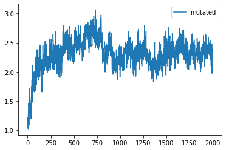
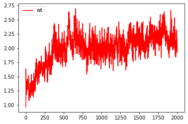
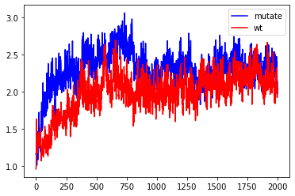
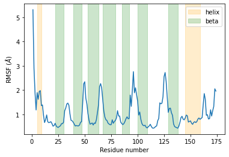
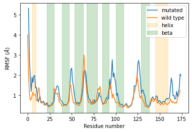
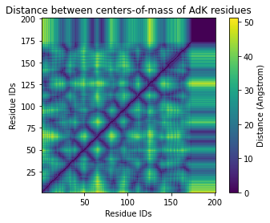
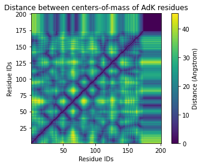
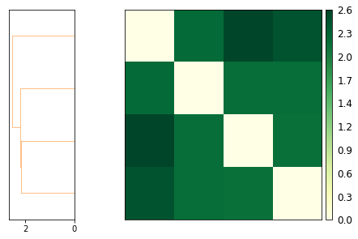
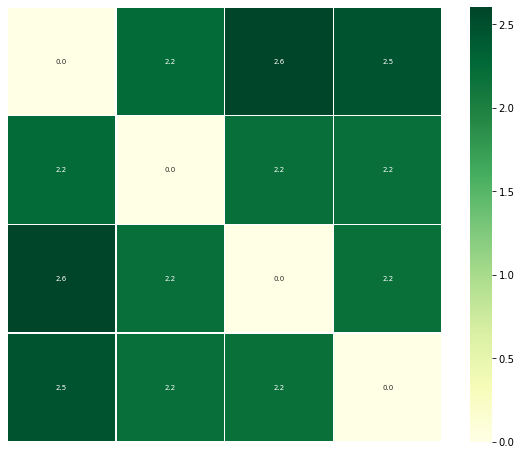

# Molecoular Dynamics (MD) trajectories analysis of RBP4 and RBP4 with G75D substitution

### The notebook shows RMSD, rmsf and distance matrices of two different structures in MD simulations. These are the human Retinol Binding Protein 4 (PDB: 5NU7) and his mutated form G75D obtained in silico. Down below it shows the geometric distances of four simulations: 1 wild-type and 3 different mutated

```python
from Bio.PDB import *
import MDAnalysis as mda
from MDAnalysis.analysis import align, rms
import numpy as np
import matplotlib.pyplot as plt
%matplotlib inline

u = mda.Universe('G75D_olo_min_1.gro', 'G75D_olo_1_100ns_whole.xtc')
```

Aligning the mutated protein trajectory to its first frame


```python
mobile = mda.Universe('G75D_olo_min_1.gro', 'G75D_olo_1_100ns_whole.xtc')
ref = mda.Universe('G75D_olo_min_1.gro', 'G75D_olo_1_100ns_whole.xtc')
```


```python
mobile.trajectory[-1]  # set mobile trajectory to last frame
ref.trajectory[0]  # set reference trajectory to first frame

mobile_ca = mobile.select_atoms('name CA')
ref_ca = ref.select_atoms('name CA')
rms.rmsd(mobile_ca.positions, ref_ca.positions, superposition=False)
```


    18.44412413091534


Without the alignment, RMSD is pretty high


```python
aligner = align.AlignTraj(mobile, ref, select='name CA', in_memory=True).run()
```


```python
mobile.trajectory[-1]  # set mobile trajectory to last frame
ref.trajectory[0]  # set reference trajectory to first frame

mobile_ca = mobile.select_atoms('name CA')
ref_ca = ref.select_atoms('name CA')
rms.rmsd(mobile_ca.positions, ref_ca.positions, superposition=False)
```


    2.041564090299203


After alignment, RMSD is now lower

## RMSD

Here we create a function to calculate the RMSD for each adiacent frame in order to plot them


```python
def calculate_rmsd(gro, xtc):
    i = 1
    frame0 = mda.Universe(gro, xtc)
    frameX = mda.Universe(gro, xtc)
    rmsd_per_frames = []
    while True:
        frame0.trajectory[0]
        frameX.trajectory[i]
        rmsd = align.alignto(frameX,  # mobile
                      frame0,  # reference
                      select='name CA', # selection to operate on
                      match_atoms=True) # whether to match atoms
        rmsd_per_frames.append(rmsd[1])
        i += 1
        if i == len(frame0.trajectory) - 1:
            break
    return rmsd_per_frames
```

RMSD plotting for the mutated RBP


```python
rmsd = calculate_rmsd('G75D_olo_min_1.gro', 'G75D_olo_1_100ns_whole.xtc')
```


```python
plt.plot(rmsd, label='mutated')
plt.legend()
plt.show();
```


    

    


RMSD plotting for the wild-type RBP


```python
rmsd_wt = calculate_rmsd('5nu7_RTOL_min.gro', '5nu7_RTOL_200ns_whole.xtc')
```


```python
plt.plot(rmsd_wt[0:1999], label='wt', color='red')
plt.legend()
plt.show();
```


    

    


```python
fig, ax = plt.subplots()

plt.plot(rmsd[0:1999], color='blue', label='mutated')
plt.plot(rmsd_wt[0:1999], color='red', label='wt')
plt.legend()
plt.show();
```


    

    


The overlay plot shows a sharp difference between the two RMSDs. 
The higher values of the mutated protein along the trajectory clearly indicate a more consistent mobility due to the mutation.


## RMSF


```python
# creating average structure

average = align.AverageStructure(u, u, select='protein and name CA',
                                 ref_frame=0).run()
ref = average.universe
```


```python
# aligning trajectory to average structure

aligner = align.AlignTraj(u, ref,
                          select='protein and name CA',
                          in_memory=True).run()
```


```python
# rmsf

atoms = u.select_atoms('protein and name CA')
rmsf = rms.RMSF(atoms).run()
```


```python
rmsf.rmsf
```


    array([5.3150234 , 2.89395263, 1.87135859, 1.18121761, 1.89781561,
           1.62013528, 1.94756304, 1.97943858, 1.35862721, 1.38892881,
           0.96094141, 0.66408667, 0.78527881, 0.97669854, 0.69637483,
           0.65803802, 0.67577146, 0.69827922, 0.62043685, 0.51419053,
           0.53781095, 0.63102065, 0.52291809, 0.47579756, 0.46076585,
           0.50251008, 0.5281953 , 0.61649348, 0.6165161 , 0.67961214,
           1.14642632, 1.25483322, 1.42760381, 1.46549767, 1.37533618,
           1.01995628, 0.75547153, 0.73911048, 0.68034399, 0.6064632 ,
           0.52154815, 0.54016965, 0.52873955, 0.52393502, 0.55583236,
           0.66997973, 0.70438067, 1.44076678, 2.26104021, 2.34439932,
           1.67015136, 1.43534422, 1.03960197, 0.76985176, 0.59741962,
           0.61863273, 0.64563453, 0.56222875, 0.64551875, 0.6259051 ,
           0.77913032, 1.07343005, 1.38834628, 2.13992152, 2.2685669 ,
           2.09602761, 1.6344783 , 1.14660147, 0.89373093, 0.77942048,
           0.74771463, 0.64067866, 0.60107508, 0.57127485, 0.57655082,
           0.77614912, 0.63285446, 0.70614198, 0.75184302, 0.85508658,
           1.15164974, 0.93182335, 0.93421795, 0.67981813, 0.62239963,
           0.57801486, 0.61862511, 0.70564346, 0.81886299, 0.89938719,
           0.81853356, 0.82981862, 1.79607062, 1.33160668, 1.996651  ,
           2.76114785, 1.88903793, 2.09807501, 1.8119079 , 1.54986427,
           0.97338336, 1.09814707, 0.80617246, 0.62785128, 0.55322086,
           0.53120132, 0.55196142, 0.47355755, 0.44002   , 0.48603128,
           0.52624239, 0.59095285, 0.49853224, 0.43707617, 0.43186703,
           0.45182767, 0.503675  , 0.52180909, 0.73671078, 0.83442521,
           1.47458619, 1.43680794, 1.46221755, 1.726612  , 2.55899364,
           2.7258692 , 2.34459709, 1.70457815, 1.0822547 , 1.24783093,
           1.25628893, 1.06307597, 0.95988099, 0.60491243, 0.49764089,
           0.47029627, 0.4505778 , 0.43035699, 0.51238397, 0.66718316,
           0.86829561, 0.92034052, 0.80477642, 0.77352337, 0.8472154 ,
           0.97240003, 0.94131668, 0.68178556, 0.70906059, 0.73138132,
           0.63564779, 0.58841524, 0.66805777, 0.69763479, 0.66207177,
           0.70326788, 0.80527381, 0.85074521, 0.79790324, 0.83150128,
           0.8690838 , 1.38068832, 1.85792373, 1.62297247, 0.9633795 ,
           0.98802863, 0.80971982, 0.82424003, 1.19053149, 0.93079929,
           1.15068186, 1.32812387, 2.05497604, 1.96155363])


RMSF plotting of the mutated protein


```python
# plotting

helix = [(5, 9), (16,21), (145,159)]
beta = [(22, 30), (39, 47), (53, 63), (67, 79), (85, 92), (100, 109), (114, 123), (129, 138)]
plt.plot(atoms.resids, rmsf.rmsf)
plt.xlabel('Residue number')
plt.ylabel('RMSF ($\AA$)')

for x in helix[0:1]:
    plt.axvspan(x[0], x[1], zorder=0, alpha=0.2, color='orange')
plt.axvspan(helix[2][0], helix[2][1], zorder=0, alpha=0.2, color='orange', label='helix')

for x in beta[0:6]:
    plt.axvspan(x[0], x[1], zorder=0, alpha=0.2, color='green')
plt.axvspan(beta[7][0], beta[7][1], zorder=0, alpha=0.2, color='green', label='beta')

plt.legend();
```


    

    


We import a table reporting rmsf values of the wt protein obtained previously from a GROMACS utility and plot against the mutated


```python
import pandas as pd

rmsf_wt = pd.read_table('rmsf_ca.xvg', skiprows=16, header=None, delim_whitespace=True) # skip header
rmsf_wt.iloc[:,1] = rmsf_wt.iloc[:,1].apply(lambda x: x * 10) # since it is in nm
rmsf_wt
```


<div>
<style scoped>
    .dataframe tbody tr th:only-of-type {
        vertical-align: middle;
    }

    .dataframe tbody tr th {
        vertical-align: top;
    }

    .dataframe thead th {
        text-align: right;
    }
</style>
<table border="1" class="dataframe">
  <thead>
    <tr style="text-align: right;">
      <th></th>
      <th>0</th>
      <th>1</th>
    </tr>
  </thead>
  <tbody>
    <tr>
      <th>0</th>
      <td>5</td>
      <td>3.992</td>
    </tr>
    <tr>
      <th>1</th>
      <td>15</td>
      <td>2.009</td>
    </tr>
    <tr>
      <th>2</th>
      <td>32</td>
      <td>1.128</td>
    </tr>
    <tr>
      <th>3</th>
      <td>41</td>
      <td>0.748</td>
    </tr>
    <tr>
      <th>4</th>
      <td>48</td>
      <td>0.818</td>
    </tr>
    <tr>
      <th>...</th>
      <td>...</td>
      <td>...</td>
    </tr>
    <tr>
      <th>169</th>
      <td>1787</td>
      <td>0.617</td>
    </tr>
    <tr>
      <th>170</th>
      <td>1801</td>
      <td>0.826</td>
    </tr>
    <tr>
      <th>171</th>
      <td>1812</td>
      <td>0.966</td>
    </tr>
    <tr>
      <th>172</th>
      <td>1817</td>
      <td>1.051</td>
    </tr>
    <tr>
      <th>173</th>
      <td>1835</td>
      <td>1.243</td>
    </tr>
  </tbody>
</table>
<p>174 rows × 2 columns</p>
</div>


```python
helix = [(5, 9), (16,21), (145,159)]
beta = [(22, 30), (39, 47), (53, 63), (67, 79), (85, 92), (100, 109), (114, 123), (129, 138)]
plt.plot(atoms.resids, rmsf.rmsf, label='mutated')
plt.xlabel('Residue number')
plt.ylabel('RMSF ($\AA$)')

for x in helix[0:1]:
    plt.axvspan(x[0], x[1], zorder=0, alpha=0.2, color='orange')
plt.axvspan(helix[2][0], helix[2][1], zorder=0, alpha=0.2, color='orange', label='helix')

for x in beta[0:6]:
    plt.axvspan(x[0], x[1], zorder=0, alpha=0.2, color='green')
plt.axvspan(beta[7][0], beta[7][1], zorder=0, alpha=0.2, color='green', label='beta')


plt.plot(rmsf_wt[1], label='wild type', color='red')

plt.legend();
```


    

    


RMSF plots suggest a consistent variation of fluctuation regarding the mutated form in particoular on the loops between the beta sheets (white spaces). The mutated RBP loss therefore some of its stability because of the presence of the Aspartate in one of the sheet.

## Distances matrix

Extrapolate an array with res number of the mutated protein


```python
protein_residues = u.residues.resids[0:175]
```


```python
# Set the last frame

u.trajectory[-1];
```

Calculate the center of mass for each residue (175)


```python
res_com = u.atoms.center_of_mass(compound='residues')
res_com = res_com[0:175]
n_res = len(res_com)
n_res
```


    175


Create a vector which contains distance values of a square distance matrix.


```python
from MDAnalysis.analysis import distances
res_dist = distances.self_distance_array(res_com)
```

Create an all-zero array and get the indices of the upper and lower triangular matrices.


```python
sq_dist_res = np.zeros((n_res, n_res))
triu = np.triu_indices_from(sq_dist_res, k=1) # matrix indices
triu
```


    (array([  0,   0,   0, ..., 172, 172, 173]),
     array([  1,   2,   3, ..., 173, 174, 174]))


With the tuple of indices, we fill up the upper and lower triangulars with distance values


```python
sq_dist_res[triu] = res_dist
sq_dist_res[0:4,0:4] # only for visualization
```


    array([[0.        , 5.49259   , 7.90291044, 8.97852963],
           [0.        , 0.        , 4.35113257, 5.83882834],
           [0.        , 0.        , 0.        , 4.25009742],
           [0.        , 0.        , 0.        , 0.        ]])


```python
sq_dist_res.T[triu] = res_dist
sq_dist_res[0:4,0:4]
```


    array([[0.        , 5.49259   , 7.90291044, 8.97852963],
           [5.49259   , 0.        , 4.35113257, 5.83882834],
           [7.90291044, 4.35113257, 0.        , 4.25009742],
           [8.97852963, 5.83882834, 4.25009742, 0.        ]])


```python
fig2, ax2 = plt.subplots()
im2 = ax2.pcolor(protein_residues, protein_residues, sq_dist_res)

# plt.pcolor gives a rectangular grid by default
# so we need to make our heatmap square
ax2.set_aspect('equal')

# add figure labels and titles
plt.ylabel('Residue IDs')
plt.xlabel('Residue IDs')
plt.title('Distance between centers-of-mass of AdK residues')

# colorbar
cbar2 = fig2.colorbar(im2)
cbar2.ax.set_ylabel('Distance (Angstrom)');
```


    

    


We repeat the steps of above but using the wt protein


```python
u = mda.Universe('5nu7_RTOL_min.gro', '5nu7_RTOL_200ns_whole.xtc')
```


```python
fig2, ax2 = plt.subplots()
im2 = ax2.pcolor(protein_residues, protein_residues, sq_dist_res)

# plt.pcolor gives a rectangular grid by default
# so we need to make our heatmap square
ax2.set_aspect('equal')

# add figure labels and titles
plt.ylabel('Residue IDs')
plt.xlabel('Residue IDs')
plt.title('Distance between centers-of-mass of AdK residues')

# colorbar
cbar2 = fig2.colorbar(im2)
cbar2.ax.set_ylabel('Distance (Angstrom)');
```


    

    


By comparing the two matrix you can notice a sligth variation in the distance between the atoms through the entire trajectory . This indicates an higher fluctuation of mutated protein's atoms confirming the results of RMSD and RMSF.

## Geometric similarity


```python
u1 = mda.Universe('G75D_olo/G75D_olo_min.gro', 'G75D_olo/G75D_olo_100ns_whole.xtc')
u2 = mda.Universe('G75D_olo_1/G75D_olo_min_1.gro', 'G75D_olo_1/G75D_olo_1_100ns_whole.xtc')
u3 = mda.Universe('G75D_olo_1_no_water/G75D_olo_min_1_no_water.gro', 'G75D_olo_1_no_water/G75D_olo_1_whole_no_water_100ns.xtc')
u4 = mda.Universe('G75D_olo_2_no_water/G75D_olo_min_1_no_water.gro', 'G75D_olo_2_no_water/G75D_olo_2_100ns.xtc')
```


```python
ref = mda.Universe('G75D_olo_1/G75D_olo_min_1.gro')
labels = ['1', '2', '3', '4']
```

Performing a path similarity analysis. Each path contains all structures of a trajectory.


```python
from MDAnalysis.analysis import psa
CORE_sel = 'name CA and (resid 0:175)'
ps = psa.PSAnalysis([u1, u2, u3, u4],
                    labels=labels,
                    reference=ref,
                    select=CORE_sel,
                    path_select='name CA')
```


```python
ps.generate_paths(align=True, save=False, weights=None)
```

Similarity matrix of paths for each trajectory.


```python
ps.run(metric='hausdorff')
ps.D
```


    array([[0.        , 2.2027016 , 2.20439806, 2.24507735],
           [2.2027016 , 0.        , 2.17974016, 2.60440557],
           [2.20439806, 2.17974016, 0.        , 2.46711722],
           [2.24507735, 2.60440557, 2.46711722, 0.        ]])


```python
ps.plot(linkage='ward')
```


    (array([[1.        , 2.        , 2.17974016, 2.        ],
            [0.        , 4.        , 2.21142964, 3.        ],
            [3.        , 5.        , 2.55823415, 4.        ]]),
     {'icoord': [[25.0, 25.0, 35.0, 35.0],
       [15.0, 15.0, 30.0, 30.0],
       [5.0, 5.0, 22.5, 22.5]],
      'dcoord': [[0.0, 2.179740157909635, 2.179740157909635, 0.0],
       [0.0, 2.2114296416675465, 2.2114296416675465, 2.179740157909635],
       [0.0, 2.5582341540006834, 2.5582341540006834, 2.2114296416675465]],
      'ivl': ['3', '0', '1', '2'],
      'leaves': [3, 0, 1, 2],
      'color_list': ['C1', 'C1', 'C1']},
     array([[0.        , 2.24507735, 2.60440557, 2.46711722],
            [2.24507735, 0.        , 2.2027016 , 2.20439806],
            [2.60440557, 2.2027016 , 0.        , 2.17974016],
            [2.46711722, 2.20439806, 2.17974016, 0.        ]]))


    <Figure size 432x288 with 0 Axes>


    

    


Heatmap plot with the annotations of distance values.


```python
ps.plot_annotated_heatmap(linkage='single')
```


    (array([[1.        , 2.        , 2.17974016, 2.        ],
            [0.        , 4.        , 2.2027016 , 3.        ],
            [3.        , 5.        , 2.24507735, 4.        ]]),
     {'icoord': [[25.0, 25.0, 35.0, 35.0],
       [15.0, 15.0, 30.0, 30.0],
       [5.0, 5.0, 22.5, 22.5]],
      'dcoord': [[0.0, 2.179740157909635, 2.179740157909635, 0.0],
       [0.0, 2.2027016033295244, 2.2027016033295244, 2.179740157909635],
       [0.0, 2.2450773513501345, 2.2450773513501345, 2.2027016033295244]],
      'ivl': ['3', '0', '1', '2'],
      'leaves': [3, 0, 1, 2],
      'color_list': ['C1', 'C1', 'C1']},
     array([[0.        , 2.24507735, 2.60440557, 2.46711722],
            [2.24507735, 0.        , 2.2027016 , 2.20439806],
            [2.60440557, 2.2027016 , 0.        , 2.17974016],
            [2.46711722, 2.20439806, 2.17974016, 0.        ]]))


    <Figure size 432x288 with 0 Axes>


    

    


All simulations of mutated RBP4 cluster together highlighting the difference between the two structures although the sostitution of a single aminoacid. 


```python

```
